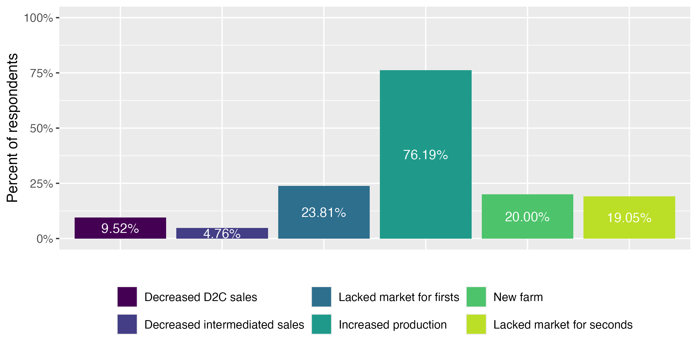
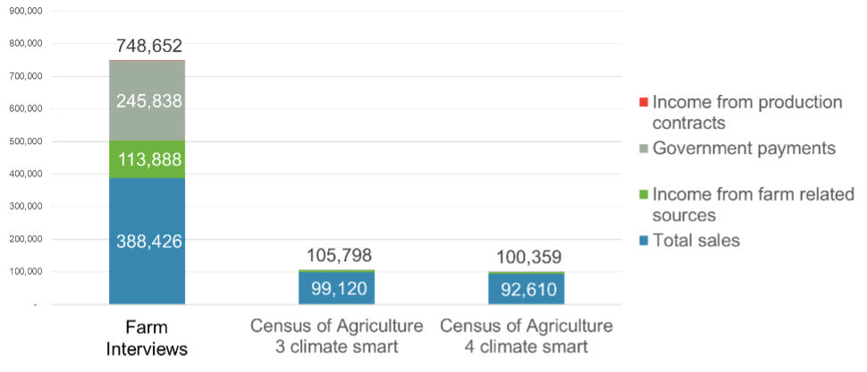
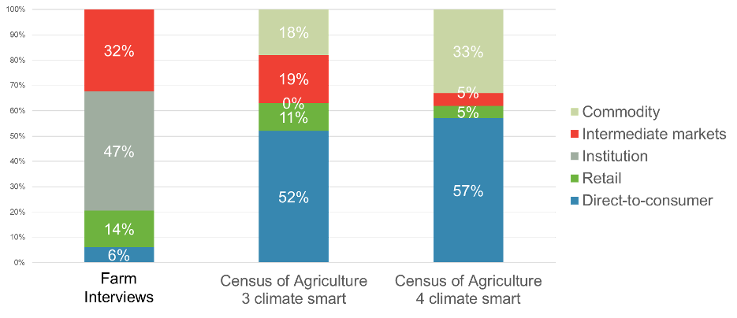
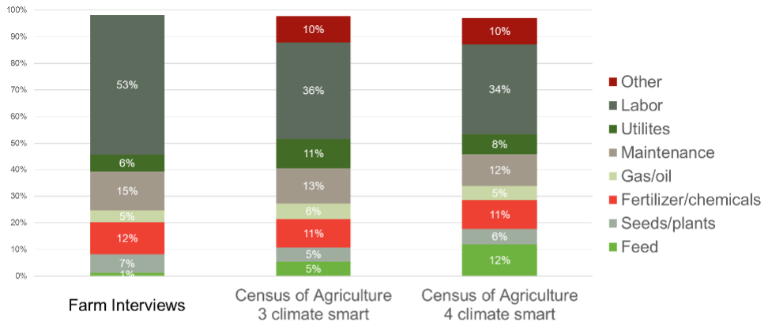
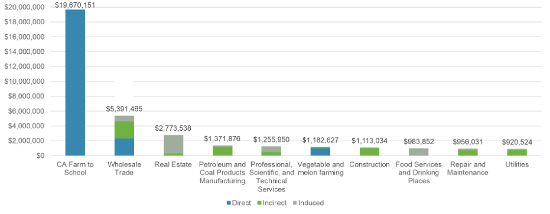

# Issue brief

## Farm-level Impacts

### How farms respond to farm to school incentives

#### What we did

In partnership with other members of the farm to school evaluation team, we conducted surveys and interviews with farms that received incentives through California's farm to school grant program to understand whether and how participation affected their operations.

#### What we found

Participating Food Producer Grantees reported operational changes associated with participation in the F2S Grant Program. The most common response was increased production. More than three-quarters of surveyed producers reported expanding production to accommodate school sales (Figure 1). In contrast, relatively few producers reported reducing sales through direct-to-consumer or intermediated market channels. These findings suggest that farm to school markets may provide growth opportunities for participating farms rather than simply shifting products away from existing buyers.

Many producers also reported that farm to school sales helped address market access challenges. Nearly one-quarter reported that they previously lacked adequate markets for first-quality products, while nearly one-fifth reported that farm to school created opportunities to market seconds or imperfect products that previously lacked reliable buyers. Among producers reporting expansion, average sales and acreage both increased. While responses varied substantially across operations, the overall pattern suggests that participation was associated with business growth opportunities among most surveyed farms.

### Characteristics of participating farms

#### What we did

Because we did not have true pre-program baseline data on expenses or profitability for participating farms, we compared participating operations to similar farms in California using restricted-access 2022 Census of Agriculture microdata.

The Census of Agriculture is a complete count of U.S. farms and ranches and includes information on land use and ownership, operator characteristics, production practices, income, and expenditures. It is the only source of comprehensive, nationally consistent farm-level data across all counties in the United States. For this project, we used restricted-access Census data to benchmark expenditure patterns and profitability among similar California farms.

We defined "similar operations" based on commodity mix, scale, participation in local and regional market channels, and production practices, including indicators related to soil health, grazing, organic production, and other Climate Smart practices. Accordingly, our "similar operations" included those farms located in California, with primary commodity fruit or vegetables[^1], with more than $1,000 but less than $500,000 in gross cash farm income, that reported non-zero sales through local food markets, and that used at least three conservation practices. @tbl-crosswalk shows how the Census of Agriculture Climate Smart practices categories align with what 2023 Producer Grantees were asked to report for Climate Smart practices.

[^1]: Defined as at least 50 percent of sales coming from fruits and/or vegetables.

| **2022 Census of Agriculture Climate Smart Categories** | **2023 Producer Grantees Climate Smart Production Categories** |
|---|---|
| Planted to a cover crop (cover crops are planted primarily for managing soil fertility, soil quality, and controlling weeds, pests, and diseases; excluding CRP acres) | Cover crop; Conservation Cover |
| Utilized no till or reduced till practices | No till; Reduced till |
| Practice alley cropping, silvopasture, or forest farming, or have riparian forest buffers or windbreaks | Strip cropping; Hedgerow planting; Windbreak/Shelterbelt Establishment; Vegetative Barriers; Riparian Forest Buffer; Tree/Shrub Establishment; Riparian Herbaceous Cover |
| Has acres of cropland and pastureland on which animal manure was applied | Compost |
| Practice rotational or management-intensive grazing | Prescribed grazing |
| Organic (USDA NOP certified organic production, USDA NOP organic production exempt from certification, Acres transitioning into USDA NOP organic production, Production according to USDA NOP standards but NOT certified or exempt) | Certified organic; Transitioning organic; Non-certified organic; Pesticide free |
| Not matched | Nutrient management; Crop rotation; Crop-livestock integration; Grassed Waterway; Filter Strip; Rain catchment for irrigation |

: 2022 Census of Agriculture to 2023 Producer Grantee Climate Smart Practices Crosswalk {#tbl-crosswalk}

Using Census data, we compared 2024 Grantees to similar operations across major expense categories, including labor, seed and plant purchases, fertilizer and chemicals, fuel, utilities, repairs and maintenance, custom work, and livestock-related purchases. We used this information to examine net farm income, our measure of farm profitability, as well as other financial characteristics.

#### What we found

Participating Food Producer Grantees appear to represent a distinct subset of California fruit and vegetable farms characterized by larger scale, stronger engagement with institutional markets, and greater participation in government-supported programs. While these differences should not be interpreted as causal impacts of the F2S Grant Program, they provide important insights into the types of operations currently participating in the program.

At the sector level, participating farms reported average gross cash farm income of approximately $749,000, compared to approximately $100,000 among comparable California farms that sold through local food market channels and utilized multiple Climate Smart production practices. One of the most notable differences among income sources is "government payments", which could, in part, be due to their participation in this program. It is likely that farms that know how to apply for government programs, and are successful in receiving these funds, are different compared to those that do not apply and do not receive funds (Figure 2).

Participating farms also reported substantially different marketing patterns. Nearly half of all sales among participating farms were made through institutional buyers, whereas institutional sales represented little or no reported sales among comparison farms. Participating farms also relied less on commodity markets and more heavily on retail, intermediated, and institutional channels (Figure 3).

Expense patterns were generally similar across groups. However, participating farms devoted a larger share of expenditures to labor than comparison farms. This difference is consistent with the labor-intensive nature of supplying differentiated and institutional markets (Figure 4). Differences in labor expenditure as a percent of total variable expenses will come to play an important role in the economic impact assessment.

These findings raise important questions about program targeting and participation. Understanding who participates — and who does not — may help improve program accessibility and effectiveness.

## Regional Economic Impacts

Economic impact assessments estimate how a change, or "shock," to a local economy ripples through other sectors. The magnitude of the impact depends largely on how interconnected the economy is: the more one industry buys from another within the region, the larger the economic multiplier. Accordingly, we estimate the economic impact of the California F2S Incubator Grant Program based on how participating farms spend money and sell their product(s) and how those expenditures and sales circulate through California's economy.

### What we did

We used 2024 IMPLAN data, one of the most widely used tools for regional economic impact analysis, as the starting point for estimating multipliers. The study region was defined as California.

Using data collected from 2024 producer grantees, we created a customized farm to school farm subsector to better represent the expenditure and sales patterns of California Farm to School Incubator farms. This approach improves on a standard, off-the-shelf multiplier by incorporating participant-specific information on how farms spend program-related revenue.

We then modeled the economic "shock" associated with state investment in the program, based on the sector that received the funds and estimated the resulting direct, indirect, and induced effects. Importantly, following best practices from the USDA AMS' *The Economics of Local Food Systems Toolkit* (2017), we estimated net rather than gross effects. Where producers reported that school sales replaced other sales or reduced purchases from certain sectors, we incorporated offsetting negative shocks to avoid overstating the program's economic impact.

### What we found

For 2024 producer grantees, approximately $18.6 million in grant funding generated an estimated $36.1 million in total economic activity through direct, indirect, and induced effects. When 2022 and 2024 producer grantees are considered together, the program generated an estimated $49.3 million in economic activity statewide.

The estimated output multiplier of 2.1 indicates that every $1 invested through the F2S Grant Program generated approximately $2.10 in total economic activity. Put differently, each dollar invested generated an additional $1.10 of economic activity in other sectors of California's economy.

These impacts reflect not only spending by participating farms, but also the economic activity generated when those farms purchase inputs, hire labor, and support household spending throughout California's economy. Figure 5 shows the distribution of the direct, indirect, and induced impacts across the top 10 impacted sectors from 2022 and 2024 Grantees.

## Methodological Considerations and Limitations

### Strengths

- Mixed-methods approach
- Comparison to similar operations using Census microdata
- Ability to supplement self-reported data with population-level benchmarks
- Customized economic impact modeling rather than off-the-shelf multipliers
- Focus on net rather than gross effects, including displacement where reported

### Limitations

- No true pre-program baseline for participant profitability or expenses
- Self-reported survey responses may include recall bias
- Economic impact estimates are model-based and assumption-dependent
- Causal inference requires a credible comparison group so pre/post data would strengthen future assessments
- Observed differences between participating farms and comparison farms should therefore be interpreted as suggestive, not definitive evidence of program impact

## Implications

The California Farm to School Incubator Grant Program appears to support producer participation in institutional markets while generating economic benefits that extend beyond participating farms.

Three findings emerge from this analysis:

**First**, participating producers generally reported expanding production to accommodate school sales. Few respondents reported reducing sales through existing market channels, suggesting that farm to school often functions as a growth opportunity rather than simply replacing existing sales.

**Second**, participating farms represent a distinctive subset of California producers. Compared to otherwise similar fruit and vegetable farms, participating operations were larger, more engaged in institutional markets, and more likely to receive government payments. Understanding who currently participates — and who does not — may help policymakers identify opportunities to improve program accessibility and reach.

**Third**, investments in the F2S Grant Program generated substantial economic activity throughout California. Participating farms reported purchasing many inputs from California businesses, allowing program expenditures to circulate through local supply chains and households.

Several important questions remain. Although participating farms reported expanding production and acreage, this analysis cannot determine what would have occurred in the absence of the program. Future research should examine whether observed changes represent truly additional economic activity and Climate Smart production or whether some changes would have occurred regardless of program participation.

Answering these questions will help policymakers maximize the economic, environmental, and community benefits associated with future farm to school investments.

