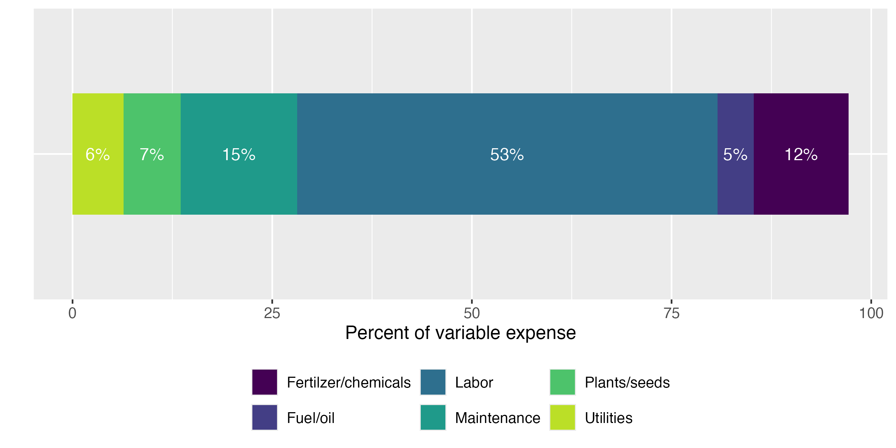
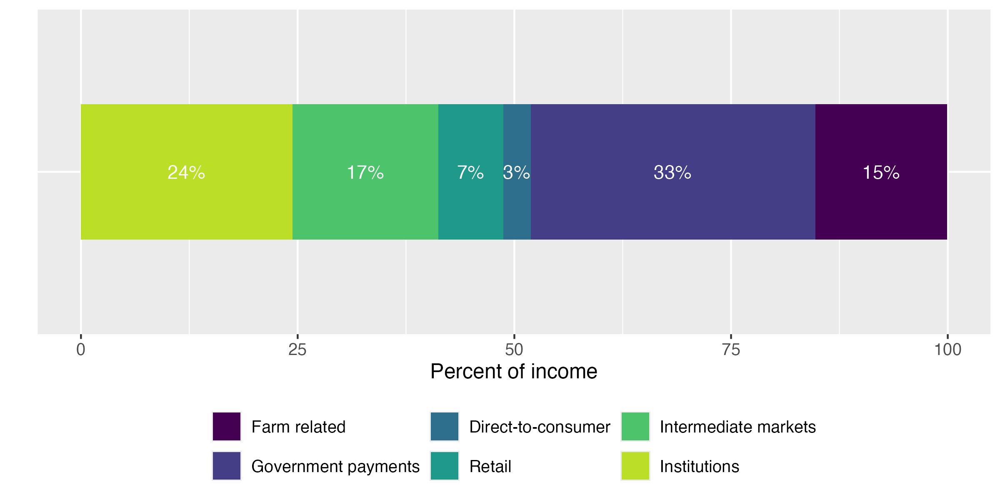

To estimate the regional economic impacts associated with state investment in the Farm-to-School (F2S) Grant Program we used commercially available data from IMpact Analysis for PLANning (IMPLAN, 2024 Data Year),[^1] an input-output model and the most commonly used tool for economic impact assessments [@miller_blair_2009]. We augmented the model with interview data collected from F2S grant participants and from the Census of Agriculture.

[^1]: All sectors are aggregated with the 528 base industry set with vegetable and melon farming and fruit farming disaggregated from the broader crop sector.

Input-output models have been used to evaluate local food systems in many specific regions of the United States [e.g., @bauman_etal_2024; @schmit_jablonski_2017]. The accuracy of input-output studies are largely dependent on the production functions employed, especially in the sectors of interest, especially for the inputs of the sector of interest [@bauman_etal_2024; @schmit_jablonski_2017]. The customization of production functions has been central to numerous prior economic contribution and impact analyses, in which enterprise budgets or expenditure profile surveys serve as the basis for constructing tailored sectors [e.g., @bauman_etal_2024; @koirala_etal_2020; @leonard_watson_2011; @schmit_jablonski_2017; @thilmany_etal_2017].

Research specifically related to local food systems has argued that the available sectors in IMPLAN do not accurately characterize local food systems, leading them to customize production functions to better represent this sector [e.g., @schmit_jablonski_2017; @thilmany_etal_2017]. We follow @bauman_etal_2024, @jablonski_etal_2016, and @thilmany_etal_2017 to create a F2S sector using customized production functions based on surveys of expenditure profiles. We use data collected from interviews of grant recipients to estimate average expenditure and spending profiles of the F2S sector and the restricted-access farm level 2022 Census of Agriculture data to estimate the total size of the sector.

## Creating a Farm to School Sector

The first step of customizing a new sector is to understand the expenditure patterns in the sector (i.e., the production function). Figure 1 shows expenditure patterns of F2S grant participants. Labor is by far the largest expense, representing 53% of variable expenses. This is significantly higher than the traditional fruit and vegetable sectors in IMPLAN, which are closer to 14% and highlights the importance of creating a customized farm to school sector to accurately represent this group of farmers.

::: {}

Figure 1. Variable expense categories as a percent of total variable expense  
*Source: Interviews of CA Farm-to-School grant participants*
:::

@tbl-expenditure describes how we bridged the categories of expenditure data collected in the interviews with IMPLAN sectors. Wherever possible, we used information from published case studies to inform the decisions described below [@jablonski_etal_2016; @schmit_jablonski_2017; @thilmany_etal_2016] and used margins published by IMPLAN.[^2] The Census of Agriculture sectors for livestock (breeding livestock purchased or leased, all other livestock and poultry purchased or leased) bridge to the IMPLAN sector "112 Animal Production and Aquaculture." Custom work and custom hauling bridges to IMPLAN sector "115 Support Activities for Agriculture and Forestry." Utilities purchased for the farm business bridges to IMPLAN sector "221 Utilities," while hired farm and ranch labor and proprietor income bridge to IMPLAN sector "Employee Compensation" and "Proprietor Income," respectively. We use the regional purchase coefficients from IMPLAN to estimate the proportion of margined expenditures that stay in the California economy. The IMPLAN values are very similar to what was reported in the interviews of FTS grant recipients and includes all sectors of interest.

[^2]: When there are multiple producing sectors, we average margins. We combined margins for all transportation into 484 Truck Transportation.

| **Census of Agriculture expenditure category** | **IMPLAN sector** | **Margin** |
|---|---|---|
| ***Non-margined sectors*** | | |
| Breeding livestock purchased or leased; All other livestock and poultry purchased or leased | 112 Animal Production and Aquaculture | |
| Customwork and custom hauling | 115 Support Activities for Agriculture and Forestry | |
| Utilities purchased for the farm business | 221 Utilities | |
| Hired farm and ranch labor | Employee Compensation | |
| Proprietor income | Proprietor Income | |
| ***Margined sectors*** | | |
| Feed purchased for livestock and poultry^a^ | 111 Crop Production | |
| | 42 Wholesale Trade | |
| | 444 Building Material and Garden Equipment and Supplies Dealers | |
| Seeds, plants, vines, trees, etc. purchased^b^ | 111 Crop Farming, 1112 Vegetable and Melon Farming, and 1113 Fruit Farming | 42% |
| | 42 Wholesale Trade | 55% |
| | 484 Truck Transportation | 4% |
| Fertilizer, lime, and soil conditioners purchased; Chemicals purchased^c^ | 325 Chemical Manufacturing | 48% |
| | 42 Wholesale Trade | 22% |
| | 444 Building Material and Garden Equipment and Supplies Dealers | 28% |
| | 484 Truck Transportation | 3% |
| Gasoline, fuels, and oils purchased for the farm business^d^ | 324 Petroleum and Coal Production | 63% |
| | 42 Wholesale Trade | 19% |
| | 457 Gasoline Stations | 17% |
| | 484 Truck Transportation | 2% |
| Repairs, supplies, and maintenance costs for the farm business^e^ | 23 Construction | 40% |
| | 811 Repair and Maintenance | 30% |
| | Employee Compensation | 30% |

: Bridging Census of Agriculture expenditure data with IMPLAN sectors {#tbl-expenditure}

^a^ We assume operators are purchasing 80% of feed from wholesalers and 20% directly from other farmers.\
^b^ We assume seeds, plants, vines, etc. are purchased directly from a wholesaler and the producing sectors for purchases in this category are crop farming, vegetable and melon farming, and fruit farming. The expenses are allocated between these three sectors based on the proportion of output in each sector. We average the margins for 111 Crop Farming (the margined commodity is grains), 1112 Vegetable and Melon Farming, and 1113 Fruit Farming as the producing sector and combine the retail and wholesale margins.\
^c^ We assume 75% of fertilizers and chemicals are purchased directly from a wholesaler and the remaining 25% are purchased from a retailer. For those purchases made directly from the wholesaler, we sum the retail and wholesale margin for a resulting wholesale margin of 52%.\
^d^ We assume 80% of fuel and oil purchases are made at the wholesale level on diesel, with the remaining 20% purchased at the retail level. For the 80% purchased wholesale, we sum the retail and wholesale margins for a resulting wholesale margin of 36%.\
^e^ We allocate 60% of expenditures to 23 Construction, 20% to Employee Compensation, and the remaining 20% to 811 Repair and Maintenance.

After determining the average proportion of expenditures in each category, these values are scaled to reflect total sector-level spending. We estimate total sales from a "similar" set of farms in California using the restricted access 2022 Census of Agriculture and use that number to represent the total size of the farm to school sector. The "similar" set of farms is defined as those with less than $500,000 in sales, participate in at least 3 climate smart practices[^3] and have the majority of their sales from fruits and vegetables. We estimate total sales in this sector of $22.6 million.[^4]

[^3]: See appendix for more information on climate smart practices and how we bridged the data collected through surveys of F2S participants and Census of Agriculture data.

[^4]: For reference, this represents less than 1% of all local sales in California.

The second step in sector customization involves analyzing sales patterns, i.e., who buys from the F2S sector. Our interviews capture total income and its breakdown across agricultural sales, government payments,[^5] farm-related income,[^6] and production contracts. Agricultural sales are further disaggregated by channel: direct-to-consumer, retail, institutional, and intermediate markets.[^7] Figure 2 shows the percent of total income in each category for the total sector as reported in the interviews.

[^5]: Government payments include state, local and federal government payments.

[^6]: Farm related income includes custom work, rent, sales of forest products, agritourism, dividends from cooperatives, insurance payments, renting and leasing farm machinery, etc.

[^7]: Direct-to-consumer market channels include farmers markets, on-farm stores or farm stands, roadside stands or stores, CSA (Community Supported Agriculture), online marketplaces, etc. Retail markets include supermarkets, supercenters, restaurants, caterers, independently owned grocery stores, food cooperatives, etc. Institutions include K-12 schools, colleges or universities, hospitals, workplace cafeterias, prisons, foodbanks, etc. Intermediate markets include businesses or organizations in the middle of the supply chain marketing locally- and/or regionally-branded products, such as distributors, food hubs, brokers, auction houses, wholesale and terminal markets, food processors, etc.

::: {}

Figure 2. Percent of total income by source (n = 21)

*Source: Interviews of CA Farm-to-School grant participants*\
*Notes: Income from production contracts is dropped from the figures as it represents less than 1% of total income. Farm related income includes custom work, rent, sales of forest products, agritourism, dividends from cooperatives, insurance payments, renting and leasing farm machinery, etc. Government payments include state, local and federal government payments. Direct-to-consumer market channels include farmers markets, on-farm stores or farm stands, roadside stands or stores, CSA (Community Supported Agriculture), online marketplaces, etc. Retail markets include supermarkets, supercenters, restaurants, caterers, independently owned grocery stores, food cooperatives, etc. Institutions include K-12 schools, colleges or universities, hospitals, workplace cafeterias, prisons, foodbanks, etc. Intermediate markets include businesses or organizations in the middle of the supply chain marketing locally- and/or regionally-branded products, such as distributors, food hubs, brokers, auction houses, wholesale and terminal markets, food processors, etc.*

:::

As we did with expenditures, when customizing the new F2S sector in IMPLAN, we need to translate our income categories into the appropriate IMPLAN sectors (@tbl-income). We allocate direct-to-consumer sales equally across households with income of at least $100,000. Retail sales are allocated to food and beverage stores. Intermediate market sales are allocated between food manufacturing (25%) and wholesale trade (75%). Institutional sales are allocated equally between state and local government education and hospital and health services. We assume 25% of farm related income is from agritourism and allocate that proportion equally across households with income of at least $100,000. The remaining 75% is allocated equally across crop production, vegetable and melon farming, fruit farming, and animal production. We allocate income from production contracts to food manufacturing, assuming the fruit and vegetable processors are the mostly likely production contracts for this group of farmers. Government payments are slightly different because they are a transfer payment rather than a purchase of a good or service. In IMPLAN's framework, we treat government farm payments as value-added income and allocate payments to other property type income.[^8]

[^8]: This assumes government payments are returns to the farm operation rather than labor compensation.

Government payments are allocated equally across Federal government non-defense, state/local government other, state/local government education, and state/local government hospitals and health services.

| **Interview category** | **IMPLAN sector** | **Allocation** |
|---|---|---|
| Direct-to-consumer sales | Households 100–150k | 33% |
| | Households 150–200k | 33% |
| | Households GT200k | 33% |
| Retail sales | 445 Food and Beverage Stores | 100% |
| Intermediate market sales | 311 Food Manufacturing | 25% |
| | 42 Wholesale Trade | 75% |
| Institutional sales | State/Local Govt Education | 50% |
| | State/Local Govt Hospital & Health Services | 50% |
| Farm related income | Households 100–150k | 8.3% |
| | Households 150–200k | 8.3% |
| | Households GT200k | 8.3% |
| | 111 Crop Production (not including 1112/1113) | 18.8% |
| | 1112 Vegetable and melon farming | 18.8% |
| | 1113 Fruit farming | 18.8% |
| | 112 Animal Production and Aquaculture | 18.8% |
| Production contracts | 311 Food Manufacturing | 100% |
| Government payments | Other Property Type Income | 100% |

: Bridging Census of Agriculture income data with IMPLAN sectors {#tbl-income}

Incorporating the F2S sector into the IMPLAN model does not expand the overall size of the economy; rather, it produces more precise data by better capturing the expenditure patterns generated by a distinct F2S sector — patterns that existing, more generalized IMPLAN sectors fail to fully reflect. The F2S sector was constructed from operations represented within the "Vegetable and Melon Farming" and "Fruit Farming" IMPLAN sectors. To prevent double counting, F2S expenditures and sales were subtracted from these two sectors proportionally, in accordance with IMPLAN's existing expense allocations, ensuring accurate representation both within the new sector and across the broader aggregation of farm operations. When creating the new sector and estimating the economic impact, we use the regional purchase coefficients from IMPLAN to estimate the proportion of expenditures that stay in the California economy as they are similar to what was reported in the interviews of F2S grant recipients.

Another important consideration in economic impact studies is opportunity costs. Previous studies estimating the economic impact of increased spending in local food systems have acknowledged the need to consider opportunity costs (i.e., estimating how much an increase in sales to schools led to a decrease in sales through other market channels) [e.g., @hughes_etal_2008; @jablonski_etal_2016; @schmit_jablonski_2017; @thilmany_etal_2017]. We use data collected from interviews of grant recipients to estimate how increased sales to schools impacted sales through other market channels (Figure 3). Expanded production was the most frequently cited response with more than three-quarters of surveyed producers reporting increases to meet school demand. Few indicated pulling back from direct-to-consumer or intermediated channels, suggesting that farm to school markets tend to create new growth for participating farms rather than diverting products from existing buyers.

*Figure 3. Responses to: How did the California Farm to School Incubator Grant affect sales and production to other markets? (n = 21)*

*Source: Interviews of CA Farm-to-School grant participants*

## Estimating the Shock

To estimate the shock of increased spending in the California economy resulting from F2S grants, we allocate FIG grant awards to different sectors of the economy. @tbl-awards shows the awards by group and by the type of organization. The organization type is only available for Cohort 3, so we assume the same allocation when we have data on both cohorts. If there are two IMPLAN sectors associated with an award, it is allocated equally across the sectors.

| **Level** | **Group** | **Total Awards** | **By org type for cohorts 2 & 3** | **IMPLAN sector** |
|---|---|---|---|---|
| Overall Total | Cohorts 2 & 3 | $25,444,967 | | |
| By Cohort | Cohort 2 | $6,824,488 | | |
| By Cohort | Cohort 3 | $18,620,479 | | |
| Org Type | Aggregator/Food Hub/Distributor | $1,157,223 | $1,581,350 | 42 Wholesale Trade |
| Org Type | California Native American Tribe | $350,000 | $478,277 | State/Local Govt Other |
| Org Type | Co-op/Food Hub | $699,782 | $956,255 | 42 Wholesale Trade |
| Org Type | Farm + Aggregator/Food Hub | $1,747,520 | $2,387,994 | CA F2S and 42 Wholesale Trade |
| Org Type | Farm + Distribution/Wholesale | $2,290,594 | $3,130,107 | CA F2S and 42 Wholesale Trade |
| Org Type | Farm Only | $12,025,414 | $16,432,781 | CA F2S |
| Org Type | Other/Unique | $349,946 | $478,203 | CA F2S |

: F2S grant awards by cohort and IMPLAN crosswalk {#tbl-awards}

*Source: Food Insight Group (FIG)*

*Notes: Org type is only available for cohort 3, so we assume the same allocation when we have data on both cohorts. If two sectors, we allocate equally across sectors.*

To model the "shock" associated with state investment in the program, based on the sector that received the funds (as shown in @tbl-awards), we estimated net rather than gross effects. Where producers reported that school sales replaced other sales or reduced purchases from certain sectors, we incorporated offsetting negative shocks to avoid overstating the program's economic impact. @tbl-output shows the net "shock" in each sector including both the increase in sales to schools as well as the resulting decrease in sales to other sectors.

| | **Scenario 1 – Cohort 3 only** | **Scenario 2 – Cohorts 2 & 3** |
|---|---|---|
| CA Farm to School | $14,394,417 | $19,670,035 |
| 42 Wholesale Trade | $3,871,062 | $5,289,823 |
| 445 Food and Beverage Stores | ($5,000) | ($6,833) |
| Households 100–150k | ($13,333) | ($18,220) |
| Households 150–200k | ($13,333) | ($18,220) |
| Households GT200k | ($13,333) | ($18,220) |
| State/Local Govt Other | $350,000 | $478,277 |

: Change in output by sector {#tbl-output}

## Model

The SAM and associated tables can all be found in "../data_final/"

## References

::: {#refs}
:::

## Appendix

**Climate smart practices crosswalk between Census of Agriculture and California Farm to School Cohort 2 Grantees**

| **Census of Agriculture** | **Cohort 2 Grantees** |
|---|---|
| Planted to a cover crop (cover crops are planted primarily for managing soil fertility, soil quality, and controlling weeds, pests, and diseases; excluding CRP acres) | Cover crop; Conservation Cover |
| Utilized no till or reduced till practices | No till; Reduced till |
| Practice alley cropping, silvopasture, or forest farming, or have riparian forest buffers or windbreaks | Strip cropping; Hedgerow planting; Windbreak/Shelterbelt Establishment; Vegetative Barriers; Riparian Forest Buffer; Tree/Shrub Establishment; Riparian Herbaceous Cover |
| Has acres of cropland and pastureland on which animal manure was applied | Compost |
| Practice rotational or management-intensive grazing | Prescribed grazing |
| Organic (USDA NOP certified organic production, USDA NOP organic production exempt from certification, Acres transitioning into USDA NOP organic production, Production according to USDA NOP standards but NOT certified or exempt) | Certified organic; Transitioning organic; Non-certified organic; Pesticide free |
| Not matched | Nutrient management; Crop rotation; Crop-livestock integration; Grassed Waterway; Filter Strip; Rain catchment for irrigation |
