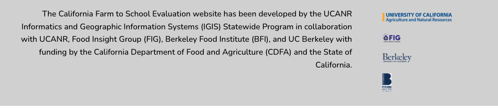

# Introduction {.unnumbered}

The State of California has made one of the nation's largest public investments in farm to school, allocating approximately \$100 million over three years. A substantial portion of these funds supports the California Farm to School Incubator Grant Program, which grew from \$10 million in its inaugural year to \$60 million in 2022–23. The California Department of Food and Agriculture designed the F2S Grant Program to strengthen connections among California farms, schools, and communities while advancing goals related to equity, climate resilience, local economic development, and student nutrition.

As California continues to invest in farm to school, policymakers require evidence not only on how funds are distributed, but also on how participating farms respond, which producers are currently accessing program resources, and whether program spending generates broader economic benefits. This brief examines producer responses to farm to school incentives, compares participating farms to similar California operations, and estimates the statewide economic impacts associated with program investments.

## Executive Summary / Key Takeaways

California has made a substantial investment in farm to school through the California Farm to School Incubator Grant Program (F2S Grant Program). As state leaders consider future investments, understanding how these funds affect participating farms and California’s economy can help inform future program design and implementation.

Using survey data from 2022 Food Producer Grantees, restricted-access 2022 Census of Agriculture data, and regional economic impact modeling, this brief:

1.  Examines how participating farms report responding to farm to school incentives.
2.  Assesses how participating farms compare to similar California fruit and vegetable operations.
3.  Estimates regional economic impacts associated with state investment in the F2S Grant Program.

*Why this matters for policy*

- Provides evidence on how farm to school incentives influence farm business decisions.
- Improves understanding of the types of operations that benefit from the current program.
- Demonstrates how program spending circulates through California's economy.

*Top takeaways*

**Farm to school markets appear to provide growth opportunities for participating farms.**

- Seventy-six percent of participating farms reported increasing production to accommodate school sales.
- Few respondents reported reducing sales through existing market channels, suggesting that farm to school largely supported expansion rather than replacement of existing markets.
- Participating farms reported increases in both sales and acreage associated with school market opportunities.
- Twenty-four percent of respondents reported that farm to school provided an outlet for first-quality products that previously lacked adequate markets.
- Nineteen percent reported that farm to school created market opportunities for seconds or imperfect products.

**Participating farms represent a distinct subset of California producers.**

- Participating farms:

  - Differed substantially from comparable California fruit and vegetable farms that sold through local food market channels and adopted Climate Smart production practices.
  - Allocated a much larger share of sales directly to institutional markets.
  - Reported greater reliance on government-supported programs.
  - Devoted a larger share of expenditures to labor, perhaps reflecting the labor-intensive nature of supplying institutional markets, and the lack of participation in less labor-intensive commodity markets.

**The program generates substantial statewide economic activity**.

- Approximately \$18.6 million in 2022 grant funding generated an estimated \$36.1 million in statewide economic activity.
- Across 2021 and 2022 Grantees, the program generated an estimated \$49.3 million in economic activity.
- Every \$1 invested through the F2S Grant Program generated approximately \$2.10 in total economic activity throughout California.  

## License

This website is free to use and is licensed under the [Creative Commons Attribution-NonCommercial-NoDerivs 4.0 International](https://creativecommons.org/licenses/by-nc-nd/4.0/)

## Thank you to our funders and partners

[California Farm to School Incubator Grant Program Evaluation](https://californiafarmtoschooleval.org/) 

```{r, echo=FALSE}


```
